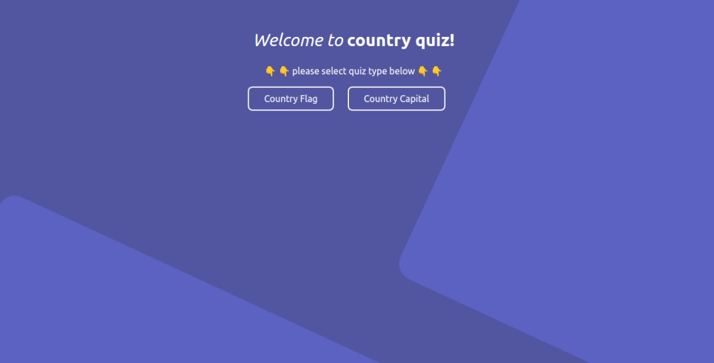
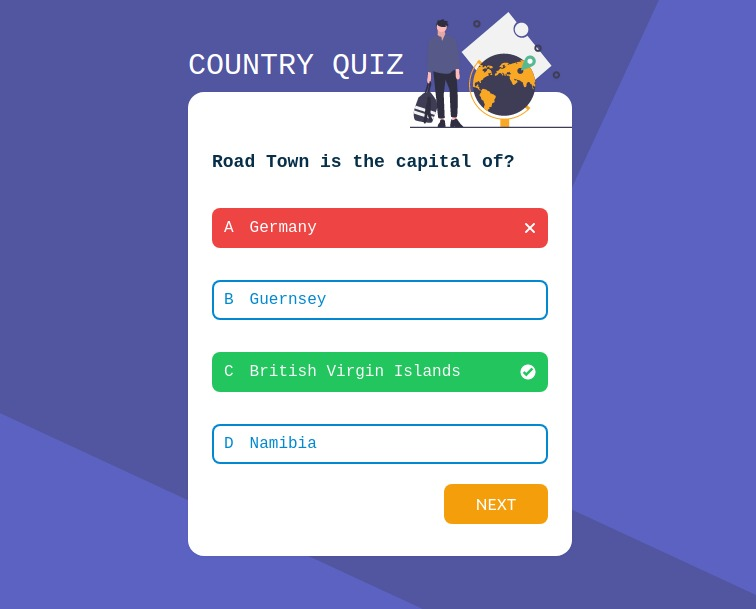

# Country Quiz Application

A Vue.js application that allows users to test their knowledge of countries by answering quizzes based on country capitals or flags. The application utilizes the REST Countries API to retrieve country information.

## Technologies Used
- Vue.js
- REST Countries API

## Installation
1. Clone the repository: `git clone https://github.com/Ericwiz/country-quiz`
2. Navigate to the project directory: `cd country-quiz`
3. Install dependencies: `npm install`

## Usage
1. Start the application: `npm run dev`
2. Open your web browser and access the application at `http://localhost:5173`.
3. Choose the quiz type by selecting either "Quiz by Country Capital" or "Quiz by Flag".
4. Answer the questions by selecting the correct option.
5. View your score at the end of the quiz.

## Screenshots

## Features
- Two quiz types: Quiz by Country Capital and Quiz by Flag.
- Randomized questions for an engaging experience.
- Interactive user interface for seamless navigation.
- Score tracking to monitor performance.

## API Integration
The application integrates with the REST Countries API to fetch country information such as capitals, flags, and more. It utilizes API endpoints to retrieve data dynamically.

## Challenges Faced
During the development process, some challenges were encountered in handling asynchronous API calls and managing state transitions. However, I was able to overcome this challenges along the line.

## Future Enhancements
- Add a timer to each quiz for an additional challenge.
- Implement a leaderboard to track high scores.
- Include additional quiz categories, such as population or languages.

## Acknowledgments
- The Vue.js documentation and community for providing valuable resources.
- devChallenges for providing this amazing challenge.
- The REST Countries API for supplying the necessary country data.

## License
<!-- This project is licensed under the MIT License. See the [LICENSE](LICENSE) file for more details. -->

## Contact Information
For any questions or feedback, please reach out to [wisdomagu44@gmail.com](wisdomagu44@gmail.com).

## References
- [vue.js documentation](https://vuejs.org/guide/introduction.html)
- [devChallenges.io](https://devchallenges.io/)
- [rest countries API](https://restcountries.com/)
